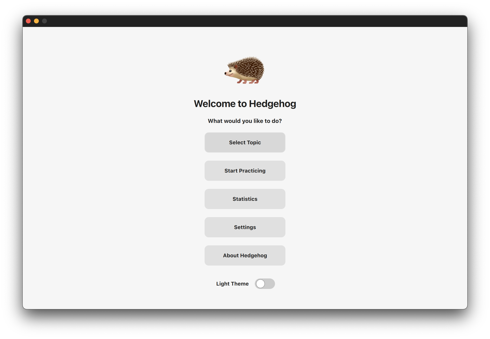
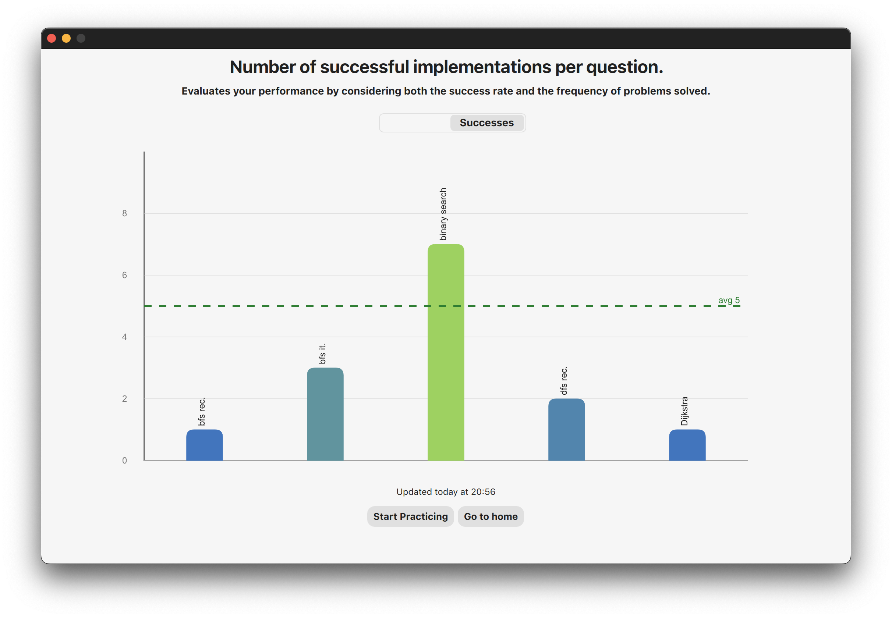

<div align="center">
    <a href="https://buymeacoffee.com/kounkou">
        
    </a>
</div>






# Platforms

- MacOS   (Full compatibility)
- Linux   (Testing in progress)
- Windows (Not tested)

For the best experience, I currently recommend using Hedgehog on macOS for its optimal look and feel. That said, you can still run the application on Linux and Windows without any issues. I'm actively refining the styles for both platforms to ensure a polished experience across all operating systems.


# Hedgehog

In an AI-driven world, algorithms and data structures remain critical for optimizing, debugging, and understanding systems at a deeper level. While AI tools can automate many aspects of coding, they cannot replace the fundamental knowledge required to create, understand, and refine complex software solutions effectively.


# How it works

### Architecture 


### Hedgehog features

Hedgehog is a user-friendly tool designed to help users tackle challenges and track their progress. It offers a clean interface and efficient features to streamline solving challenges.
Key features of Hedgehog include:

- A timer to keep users focused and engaged.
- The ability to pause and resume the timer, automatically restarting when the user begins editing again, ensuring flexibility during interrupted sessions.
- Language options, currently supporting C++ and Golang, with potential for easy expansion to more languages.
- Light and dark themes to reduce eye strain and enhance comfort.
- A solution display with a toggle to switch between the user's submitted code and the expected solution.
- The ability to skip a question and proceed to the next one.
- An option to retry the same question, encouraging continued learning and improvement.

# Installation instructions

### MacOS dependencies installation

Hedgehog relies on Qt to provide you with the amazing user interface

```bash
brew install qt@5
```

You can check out Qt install on other platforms here : 

https://doc.qt.io/qt-6/get-and-install-qt.html

# How to build, install and execute Hedgehog

You can launch below commands which will generate the binary file and install the binary in /Applications/ folder

```bash
bash install.sh
```

To launch Hedgehog from the Terminal : 

```bash
cd /Applications/Hedgehog/
./Hedgehog
```

# How to contribute

We welcome your contributions! You can get involved by:

- Proposing and developing new features
- Assisting with the addition of algorithms

Your support is greatly appreciated!
